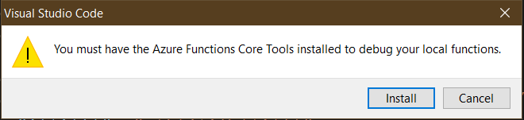
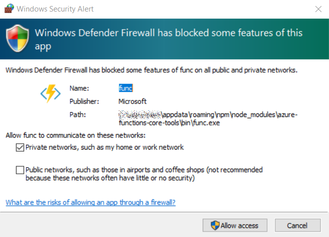

# Azure Functions “quickstart”

This is an obedient walk through “[Quickstart: Create a C# function in Azure using Visual Studio Code](https://docs.microsoft.com/en-us/azure/azure-functions/create-first-function-vs-code-csharp?tabs=in-process)” which can be useful for beginners (of course) and for the more experienced to see how Microsoft is introducing Azure Functions.

The only independent steps I am going to take are:

## installing Azurite on Ubuntu

The `npm`-based installation [📖 [docs](https://github.com/azure/azurite#npm)] of `azurite` is straight forward. The assumption here is that Azurite is a _complete replacement_ of any storage emulator included (or previously included) in Azure Functions Core Tools [[GitHub](https://github.com/Azure/azure-functions-core-tools)]. Whether this assumption is correct or incorrect, on Ubuntu, we can run the following (referenced by the current Microsoft docs) _before_ installing Azurite:

```shell
sudo apt-get install azure-functions-core-tools-4
```

- Azure Functions Core Tools essentially refers to the `func` shell command
- Azurite refers to the `azurite` shell command

I optimistically assume that installing Azurite after installing `azure-functions-core-tools-4` will disable, overwrite or simply add the correct storage emulator. Here is an [important message](https://docs.microsoft.com/en-us/azure/storage/common/storage-use-emulator) from the young folks 👶 at Microsoft:

>The Azure Storage Emulator is now deprecated. Microsoft recommends that you use the Azurite emulator for local development with Azure Storage. Azurite supersedes the Azure Storage Emulator. Azurite will continue to be updated to support the latest versions of Azure Storage APIs. For more information, see “[Use the Azurite emulator for local Azure Storage development](https://docs.microsoft.com/en-us/azure/storage/common/storage-use-azurite?tabs=visual-studio-code).”

## installing Azure Functions Core Tools and Azurite on Windows

Azure Functions development requires Azure Functions Core Tools and Azurite. The `npm`-based installation [📖 [docs](https://github.com/azure/azurite#npm)] of `azurite` is straight forward:

```shell
npm install -g azurite
```

And, like what we have on Linux (above), we need to install Azure Functions Core Tools [[GitHub](https://github.com/Azure/azure-functions-core-tools)]. However, on Windows we use `npm`:

```shell
npm i -g azure-functions-core-tools@4 --unsafe-perm true
```

When Azure Functions Core Tools is not installed then, in Visual Studio Code, this dialog should appear while attempting to start a Debug session:



This is an install prompt that will effectively run the `npm` command above.

When debugging Azure Functions locally for the first time, there might also be a Windows Defender Firewall prompt:



## installing the Azurite Visual Studio Code extension

The Azurite Visual Studio Code [extension](https://marketplace.visualstudio.com/items?itemName=Azurite.azurite) allows us to control `azurite` from VS Code. The following table summarizes an Azurite lifecycle in terms of extension commands:

| VSCode extension command | remarks
|- |-
| **Azurite: Start** | Start `azurite` in the current VSCode folder.<sup>1</sup>
| **Azurite: Close** | Should stop all `azurite` services.
| **Azurite: Clean** | Should delete almost all `azurite` folders generated by **Azurite: Start**.

---

<sup>1</sup> <small>The `azurite.location` VSCode setting should control where **Azurite: Start** writes to disk; however, Visual Studio on Windows may ignore/override these settings during debug.</small>

## generating the local project under my folder of choice

My folder of choice is the [`dotnet-azure-functions-quickstart`](../dotnet-azure-functions-quickstart) folder (in this repo) where the instructions under “[Create your local project](https://docs.microsoft.com/en-us/azure/azure-functions/create-first-function-vs-code-csharp?tabs=in-process#create-an-azure-functions-project)” are followed.

## being aware that VSCode `tasks.json` file is changed by **Create New Project…** wizard

This is an example of what is added to `tasks.json` while stepping through the “[Create your local project](https://docs.microsoft.com/en-us/azure/azure-functions/create-first-function-vs-code-csharp?tabs=in-process#create-an-azure-functions-project)” wizard:

```json
{
    "label": "clean",
    "command": "dotnet",
    "args": [
        "clean",
        "/property:GenerateFullPaths=true",
        "/consoleloggerparameters:NoSummary"
    ],
    "type": "process",
    "problemMatcher": "$msCompile",
    "options": {
        "cwd": "${workspaceFolder}/dotnet-azure-functions-quickstart/My.Functions"
    }
},
{
    "label": "build",
    "command": "dotnet",
    "args": [
        "build",
        "/property:GenerateFullPaths=true",
        "/consoleloggerparameters:NoSummary"
    ],
    "type": "process",
    "dependsOn": "clean",
    "group": {
        "kind": "build",
        "isDefault": true
    },
    "problemMatcher": "$msCompile",
    "options": {
        "cwd": "${workspaceFolder}/dotnet-azure-functions-quickstart/My.Functions"
    }
},
{
    "label": "clean release",
    "command": "dotnet",
    "args": [
        "clean",
        "--configuration",
        "Release",
        "/property:GenerateFullPaths=true",
        "/consoleloggerparameters:NoSummary"
    ],
    "type": "process",
    "problemMatcher": "$msCompile",
    "options": {
        "cwd": "${workspaceFolder}/dotnet-azure-functions-quickstart/My.Functions"
    }
},
{
    "label": "publish",
    "command": "dotnet",
    "args": [
        "publish",
        "--configuration",
        "Release",
        "/property:GenerateFullPaths=true",
        "/consoleloggerparameters:NoSummary"
    ],
    "type": "process",
    "dependsOn": "clean release",
    "problemMatcher": "$msCompile",
    "options": {
        "cwd": "${workspaceFolder}/dotnet-azure-functions-quickstart/My.Functions"
    }
},
{
    "label": "clean (functions)",
    "command": "dotnet",
    "args": [
        "clean",
        "/property:GenerateFullPaths=true",
        "/consoleloggerparameters:NoSummary"
    ],
    "type": "process",
    "problemMatcher": "$msCompile",
    "options": {
        "cwd": "${workspaceFolder}/dotnet-azure-functions-quickstart/My.Functions"
    }
},
{
    "label": "build (functions)",
    "command": "dotnet",
    "args": [
        "build",
        "/property:GenerateFullPaths=true",
        "/consoleloggerparameters:NoSummary"
    ],
    "type": "process",
    "dependsOn": "clean (functions)",
    "group": {
        "kind": "build",
        "isDefault": true
    },
    "problemMatcher": "$msCompile",
    "options": {
        "cwd": "${workspaceFolder}/dotnet-azure-functions-quickstart/My.Functions"
    }
},
{
    "label": "clean release (functions)",
    "command": "dotnet",
    "args": [
        "clean",
        "--configuration",
        "Release",
        "/property:GenerateFullPaths=true",
        "/consoleloggerparameters:NoSummary"
    ],
    "type": "process",
    "problemMatcher": "$msCompile",
    "options": {
        "cwd": "${workspaceFolder}/dotnet-azure-functions-quickstart/My.Functions"
    }
},
{
    "label": "publish (functions)",
    "command": "dotnet",
    "args": [
        "publish",
        "--configuration",
        "Release",
        "/property:GenerateFullPaths=true",
        "/consoleloggerparameters:NoSummary"
    ],
    "type": "process",
    "dependsOn": "clean release (functions)",
    "problemMatcher": "$msCompile",
    "options": {
        "cwd": "${workspaceFolder}/dotnet-azure-functions-quickstart/My.Functions"
    }
},
{
    "type": "func",
    "dependsOn": "build (functions)",
    "options": {
        "cwd": "${workspaceFolder}/dotnet-azure-functions-quickstart/My.Functions/bin/Debug/net6.0"
    },
    "command": "host start",
    "isBackground": true,
    "problemMatcher": "$func-dotnet-watch"
}
```

The F5-debugging experience in Visual Studio Code actually depends on these tasks (specifically, `"command": "host start"`) which makes me concerned about stepping through the “[Create your local project](https://docs.microsoft.com/en-us/azure/azure-functions/create-first-function-vs-code-csharp?tabs=in-process#create-an-azure-functions-project)” wizard, intending to support multiple Azure Functions projects in the same parent directory (with `/.vscode/` at the root).

## being aware of the `azureFunctions.preDeployTask` setting

Among the `azureFunctions.*` settings in the local `.vscode/settings.json` file, it is most important to remember that the `azureFunctions.preDeployTask` setting in pointing at `.vscode/tasks.json` (see “being aware that VSCode `tasks.json` file is changed by **Create New Project…** wizard” above).

## adding a `*.sln` file

A `*.sln` file is needed for the [OmniSharp](https://www.omnisharp.net/) **Select Project** command). From the `dotnet-azure-functions-quickstart/` [directory](../dotnet-azure-functions-quickstart):

```bash
dotnet new sln -n My.Functions

dotnet sln My.Functions.sln \
    add My.Functions/My.Functions.csproj
```

## using `curl` to test against the local server

The following `curl` command is a lightweight way to hit breakpoints during the F5, debugging experience:

```shell
$> curl http://localhost:7071/api/HttpExample?name=yup

Hello, yup. This HTTP triggered function executed successfully.

```

[Bryan Wilhite is on LinkedIn](https://www.linkedin.com/in/wilhite)🇺🇸💼
