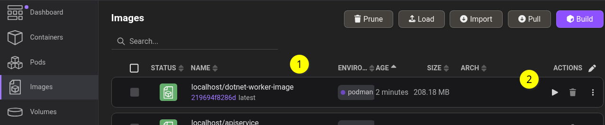

# .NET worker: containerized

This is a faithful walkthrough of “[Containerize a .NET app with dotnet publish](https://learn.microsoft.com/en-us/dotnet/core/containers/sdk-publish).”

## setup

From the `dotnet-worker-containerized` [directory](../dotnet-worker-containerized):

```bash
dotnet new worker -o Worker -n DotNet.ContainerImage

dotnet new sln --name DotNet.ContainerImage

dotnet sln DotNet.ContainerImage.slnx add Worker/DotNet.ContainerImage.csproj
```

## publish

From the `dotnet-worker-containerized` [directory](../dotnet-worker-containerized):

```bash
dotnet publish --os linux --arch x64 /t:PublishContainer
```

On my local desktop the `dotnet publish` command will push to my local Podman daemon, as shown in Podman Desktop:



1. the container image `localhost/dotnet-worker-image` was pushed by the `dotnet publish` command
2. we can press the Play button to activate the image

## pushing to the GitHub Container Registry (<acronym title="GitHub Container Registry">GHCR</acronym>)

As of this writing, GHCR only supports “[Personal access tokens (classic)](https://docs.github.com/en/authentication/keeping-your-account-and-data-secure/managing-your-personal-access-tokens#personal-access-tokens-classic).” After generating this token, in the bash shell, we can store this token in an environment variable and login like this:

```bash
echo $MY_GHCR_TOKEN | podman login ghcr.io -u BryanWilhite --password-stdin
```

…where:

- `$MY_GHCR_TOKEN` is the token generated on GitHub
- `BryanWilhite` is my GitHub user name

After logging in with the bash command above, we can push our container:

```bash
podman tag localhost/dotnet-worker-image ghcr.io/bryanwilhite/dotnet-core/rx-sample-dotnet-worker-image:latest

podman push ghcr.io/bryanwilhite/dotnet-core/rx-sample-dotnet-worker-image:latest
```

By default, your container image should be private and available for view at `https://github.com/your-github-user-name?tab=packages`; for example, my user name is `BryanWilhite`: <https://github.com/BryanWilhite?tab=packages>

[Bryan Wilhite is on LinkedIn](https://www.linkedin.com/in/wilhite)🇺🇸💼
